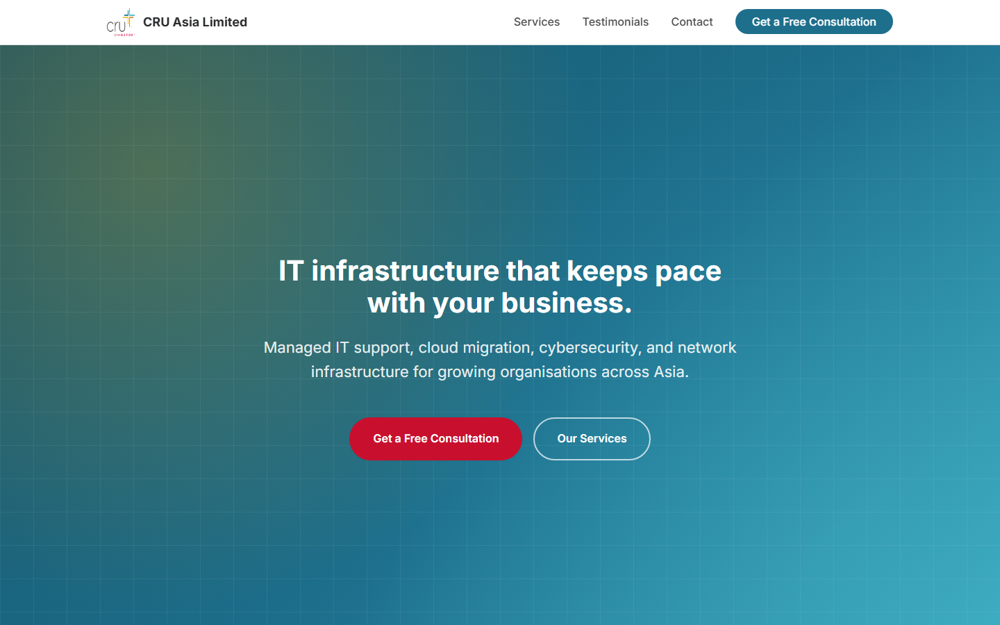

# CRU Asia Limited — IT Services Website


**🔗 Live site: [joshualee-design.github.io/cru-it-website](https://joshualee-design.github.io/cru-it-website/)**



## About

A single-page marketing site for **CRU Asia Limited**, a fictional IT services
provider offering managed IT support, cloud migration, cybersecurity, network
infrastructure, access management, and AI solutions. Built as a course exercise
with plain HTML, CSS, and vanilla JavaScript — no frameworks, no build step.

Sections: hero, a trust/stats bar, services (6 cards), testimonials (desktop
grid / mobile carousel), a lead-magnet email capture, an enquiry form with
full client-side validation and JSON `fetch()` submission, and a footer.

**Revamp additions** (built with the project's installed Agent Skills):
- **SEO** (`seo-audit`): JSON-LD `ProfessionalService` structured data, canonical
  tag, Twitter Card meta, `robots.txt` + `sitemap.xml`.
- **Design** (`frontend-design`): a light/dark theme toggle (persisted per
  visitor) and a trust bar whose four stats are underlined in the same four
  colors as the logo's cross — a signature detail instead of a generic
  gradient accent.
- **Lead magnet** (`lead-magnet`): a "Free IT Security Readiness Checklist"
  email-capture section, doubling as the asset the course brief's 10-second
  popup hook will reuse later.
- **Security** (`cybersecurity-analyst`): a `Content-Security-Policy` meta tag,
  `maxlength`/`pattern` constraints on form inputs, and a short data-handling
  note + trust badges next to the enquiry form.

## Install / run locally

There's no build step — just static files. Because the enquiry form submits via
`fetch()`, open it through a local server rather than double-clicking the HTML
file (the `file://` protocol blocks that request):

```bash
git clone https://github.com/joshualee-design/cru-it-website.git
cd cru-it-website
python -m http.server 8080
# then open http://localhost:8080
```

Any static server works (`npx serve`, VS Code's Live Server, etc.) — Python's is
just built-in on most machines.

To point the enquiry form at a real endpoint, edit the `FORM_ENDPOINT` constant
at the top of [script.js](script.js) (and `LEAD_MAGNET_ENDPOINT` for the
checklist opt-in). **If you switch either to a real domain, also update the
`Content-Security-Policy` meta tag** in [index.html](index.html) — its
`connect-src`/`form-action` currently only allow `'self'` and
`https://example.com`, and will silently block `fetch()` to any other origin.

## Credits

Built with [Claude Code](https://claude.com/code) as part of the WSQ *Agentic AI
Applications with Claude Code* course.

Hero background photo by [panumas nikhomkhai](https://www.pexels.com/@cookiecutter) via
[Pexels](https://www.pexels.com/photo/computer-server-in-data-center-room-17489163/)
(free to use, no attribution required — credited here anyway).
